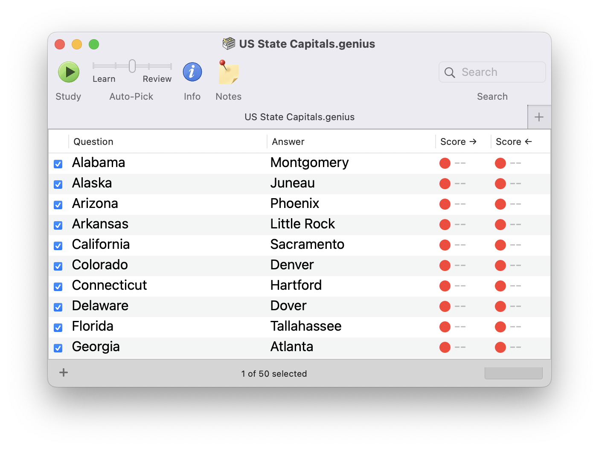

# Genius

> _Genius organizes your information and carefully chooses questions using an intelligent "spaced repetition" method that's based on your past performance._
>
> _It performs fuzzy answer checking and even highlights errors visually._
>
> _Use Genius to study foreign language phrases, vocabulary words, historical events, legal definitions, formal speeches, marketing points, religious texts - anything you need to memorize!_

– _https://genius.sourceforge.net/_

```txt
Copyright ® 2003–06 John R Chang.
Copyright ® 2007–08 Chris Miner.
```

## Backstory

[Genius](https://sourceforge.net/projects/genius/)
~~was~~ **is** a flashcard-style memorisation app for Mac OS: 


<p align="center">
    
</p>

I used this religiously to get through my secondary school French and Irish exams, it has always since been the flashcard app I've held others up against. I've never managed to 'get' Anki - there's something about the flow state of repetitively hammering out answers over and over that cements them into my brain better than just flipping cards over.

Since then, the MacOS ecosystem has obviously changed quite a fair bit, and so none of the builds available online work anymore. It seems the last straw was Apple enforcing 64-bit only binaries.

As it turns out though, the entire project is GPL, and the whole project is [_still_ hosted on SourceForge](https://svn.code.sf.net/p/genius/code/trunk/)! With some helpful hinting from Claude, I have managed to get the app built and running on arm64 macOS:

<p align="center">
    
</p>

Incredibly the only barriers to getting a fully-working build were:

- Updating the settings to use the latest macOS SDKs
- Fixing a return type (`NSComparisonResult` vs `int`; I suspect the compiler got stricter since 2008?)
- Turning off sandboxing for building the DMG - I was getting permission errors, and I presume modern ways of building DMGs don't attempt to just write directly to the XCode build directory

There are still a few rough edges left sand, but the core functionality works! It's quite surreal seeing my favourite app from nearly 20 years ago running, natively, under the latest macOS release.

## Project

At the moment this repo is a git mirror of the above SVN repo, with the bare minium getting it to work. The main code repository is in `Genius1`†. Note that the original code is licensed under the GPL, thus so is this. See `COPYING.txt`.

I have forked the history as of the _SVN revision #250_, which referenced updates to the release notes.

This seems to align with the last release `1.7.250`.

You can find three branches:

- `main`: default branch for post-2025 development
- `feat/build-250`: feature branch to get the app running
- `master`: the SVN 'trunk'

You should be able to build a binary/DMG by opening this in XCode, then just pressing build.

---

†: `Genius2` on `master` is an interesting piece of archaeology - it looks like there was an attempt to bring the app up to date with 'modern' OS X APIs, as well as introduce new features like images, rich text, and a different spaced repetition algorithm. It was eventually abandoned. See the `TODO.txt`.

If I had to guess, I reckon develoment stalled right around the time Anki was starting to take off, and the developer just picked that up instead.

## Roadmap

Everyone loves a Roadmap, but ultimately I'd consider the app 'finished', or at least feature complete. It serves my needs as-is.

The only tasks I have in mind are:

- ~~Fix the toolbar~~
- Track down Chris Miner and John R. Chang and let them know about this
- Fix/explore card 'groups' and 'types'. These are features I never actually used, but they seem to be broken.
- Put up a DMG on Github for others to use more easily, and reach out to the various souls on Sourceforge looking for new builds

I don't see it being warranted, but development could 'continue' on the app if someone wanted?

Down the line I could imagine:

- CI/CD
- Anki Deck importer
- Maybe a SwiftUI rewrite? I don't know about this really - the Obj-C codebase here works perfectly fine.
